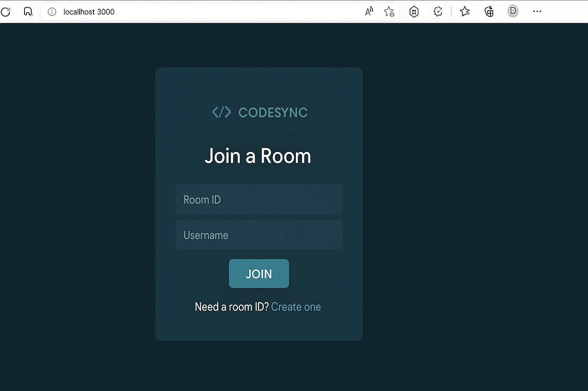
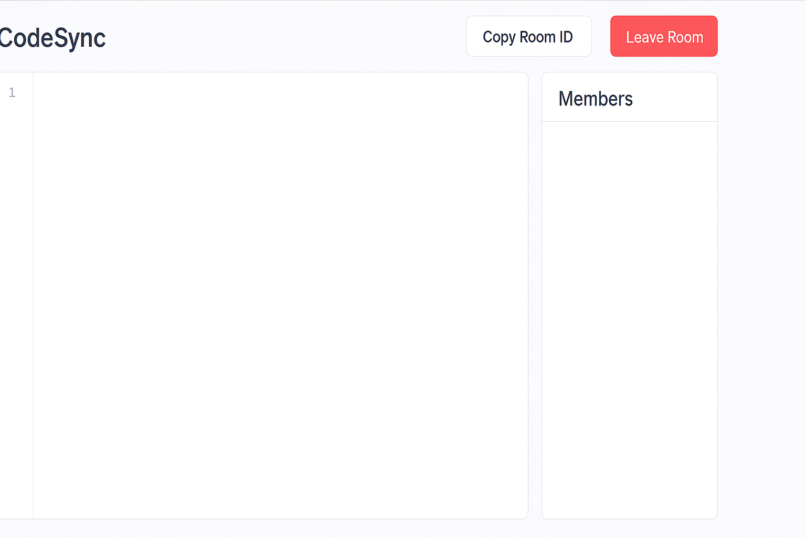

# 🚀 CodeSync – Live Collaborative Code Editor

**CodeSync** is a web-based platform that allows multiple users to collaborate on code in real-time within shared rooms. Built with modern web technologies, it provides a smooth and responsive experience for developers, students, and teams to write code together instantly.

---
## 🖼 Preview

----
## ✨ Features

- 🔐 Join or create private collaboration rooms
- 💬 Real-time code syncing using WebSockets
- 🎨 Built-in code editor with syntax highlighting (CodeMirror)
- ⚡ Instant updates across all connected users
- 🧑‍💻 Username identification for each participant

---

## 🛠 Tech Stack

- **Node.js** – Server-side environment
- **Express.js** – Backend routing and API logic
- **Socket.IO** – Real-time, bi-directional communication
- **MongoDB** – NoSQL database for session management
- **CodeMirror** – Rich, customizable code editor
- **React.js** – Frontend user interface (optional to edit)
- **uuid** – Unique room ID generator

---

